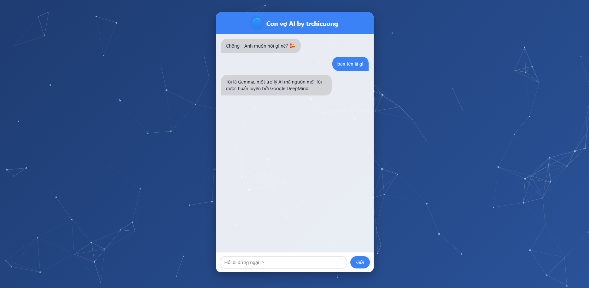

# 🤖 AI CHATBOT - Chatbot by trchicuong

Chatbot AI đơn giản viết bằng JavaScript kết nối API AI (OpenRouter). <br>
> *Demo mục đích chỉ là bản xem trước giao diện tổng thể của web, không dùng được AI!*

---

### 📥 Tải về

**Clone từ GitHub:**
```bash
git clone https://github.com/trchicuong/ai-chatbot.git
```
Hoặc tải file `.zip` từ repository.

---

### ⚙️ Cài đặt

1. **Cài Node.js** (nếu chưa có):  
https://nodejs.org

2. **Cài đặt thư viện:**
```bash
npm install
```

3. **Thêm API key ở `server.js`:**
```
const OPENROUTER_API_KEY = 'your_api_key';
```

> Nếu bạn dùng Module API miễn phí khác (như Gemini, Mistral...), hãy sửa trong `server.js`.

4. **Chạy chatbot:**
```bash
node .
```

5. **Truy cập trình duyệt:**
```
http://localhost:3000
```

---

### 📸 Hình minh họa



---

### 📁 Cấu trúc thư mục

```
ai-chatbot/
├── public/
│   ├── index.html
│   ├── style.css
│   ├── particles.json
│   └── img/logo.png
├── server.js
├── package.json
└── README.md
```
